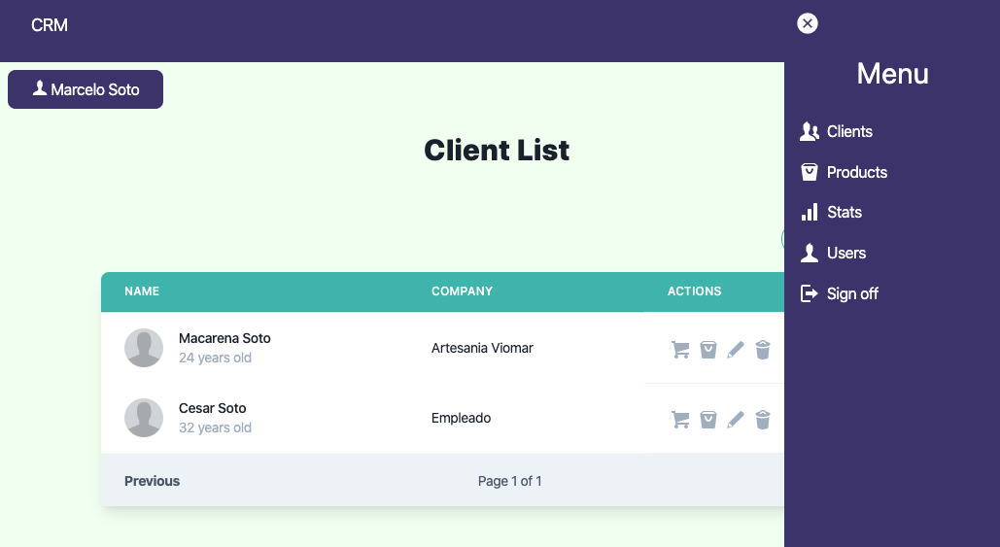

# CRM with MERN plus Apollo GraphQL, Typescript and Tailwindcss

## CRM
Please read instruction

    > Install Docker First

    > Then run docker sh docker-start.sh   

    >It will setup whole required architecture includes 

        > 1 App Backend Container which has
            - nodejs server + source code

        > 1 App Frontend Container which has
            - nodejs server + source code

        > 1 mongodb container to store user data
	  

## Build and Start Containers Images with following command
    sh docker-start.sh

## Stop Containers Images with following command
    sh docker-stop.sh

## TO rebuild Images with following command
    sh docker-rebuild.sh

## TO to remove docker-compose 
    sh remove_compose.sh

## Services Running on following ports

- 1] crmbackend app service runs on 3000 external port

- 2] crmfrontend app service runs on 8080 external port

- 3] crmmongodb service runs on 27017 external port, we can connect db using Robo 3T

    User: User
    Password: secretPassowrd
    Database: crmdb

> Note: You can change the default values ​​from the file located in the directory /initdb/init.js. Remember to change it in the connection file

## Token validation

To use the validation tokens, you will need to create a private and a public key and save the files in the directory backend/keys/ with the name of private.key and public.key

> Online RSA Key Generator: http://travistidwell.com/jsencrypt/demo/

